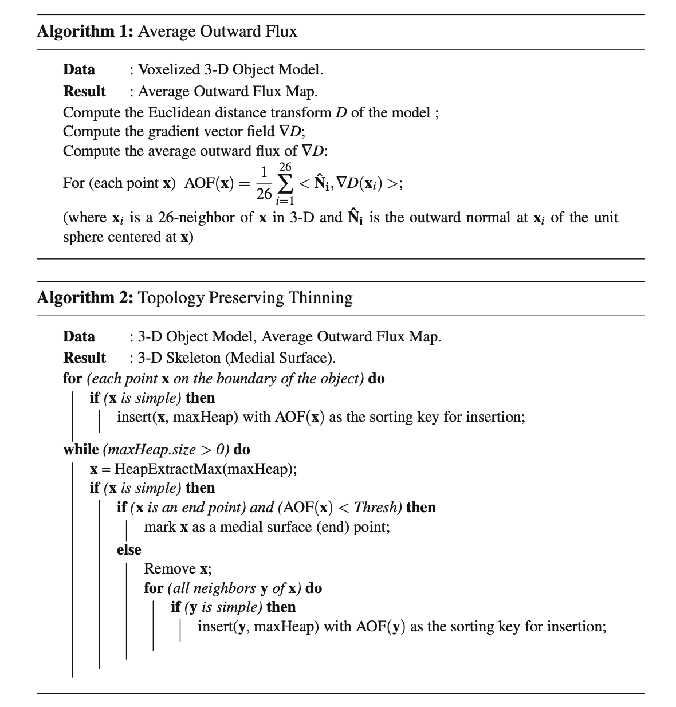

# skeleton-3D-similarity
Implementation of 3D similarity based on skeleton and graph representation from this paper : "Retrieving Articulated 3-D Models Using Medial Surfaces and Their Graph Spectra"

# Tasks 
- [ ] Voxelized 3D model.
- [ ] Find 26-neighborhood of a given point and visualise it. Evaluate its complexity.
- [ ] For a given set of discrete voxels, calculate the number of its connected components (adjacent = 26-neighbors for example). Evaluate its complexity.
- [ ] Calculate C*, and visualise all surface points. Evaluate its complexity.

# Voxelized 3D model

Under the assumption that the initial model is given in triangulated form, we begin by scaling all the vertices so that they fall within a rectangular lattice of fixed dimension and resolution. We then sub-divide each triangle to generate a dense intersection with this lattice, resulting in a binary (voxelized) 3-D model.

# AOF and topology preserving thining process

The average outward flux of the Euclidean distance function’s gradient vector field is computed through unit spheres centered at each rectangular lattice point, using Algorithm 1. This quantity has the property that it approaches a negative number at skeletal points and goes to zero elsewhere, and thus can be used to drive a digital thinning process, for which an efficient implementation is described in Algorithm 2. This thinning process has to be imple- mented with some care, so that the topology of the object is not changed. This is done by identifying each simple or removable point x.

